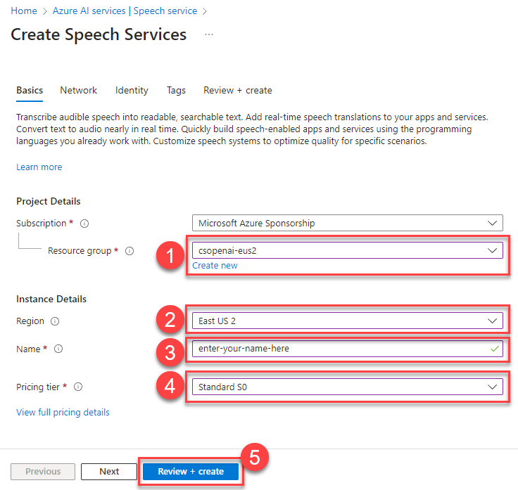

# Task 01 - Create a speech service (20 minutes)

- The steps to create an Azure AI Services Speech service in the Azure Portal are as follows:
  - Navigate to [the Azure Portal](https://portal.azure.com)
  - In the search menu, enter "Azure AI services" and select the **Azure AI services** item from the **Services** menu.
  - Choose the **Speech service** entry from the **Azure AI services** menu.
  - Select **+ Create** to create a new speech service.
  - In the Create Speech Services menu, ensure that you select the same resource group and region that you chose for your OpenAI service. Choose the **Standard S0** pricing tier for this service.
  - Select the **Review + create** button to review your choices and then choose **Create** to build the service.

    

- Navigate to the [OpenAI Studio](https://oai.azure.com) and make sure you are in the chat playground by selecting **Chat** from the **Playground** menu.
- Navigate to **Add your data (preview)** and ensure that you still have the hotel and resorts index selected as your data source. If not, review the instructions in [Exercise 02, Task 02](../02_add_chat_with_data/0202.md) to repopulate this data source.
- In the chat playground, select the microphone icon below the user query input box.

    

- In the Playground Settings modal dialog, choose your speech resource from the drop-down list. Then, check the box acknowledging that spoken chat will incur usage to your subscription and enable speech to text. Select **Save** to complete the process.

    

- Select the microphone icon below the user query box. Using your microphone, speak the following request: "I've visited Aruba and Bonaire before. What other resort locations would be good options if I want to scuba dive?"

    {: .note }
    > Your browser may prompt you for access to use your microphone.
