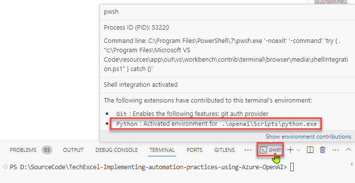

# Task 01 - Install client tools (20 minutes)

## Introduction

There are several client tools that you will use throughout this lab. These are standard tools for teams working with AI services from both Microsoft and other companies. The first task in this exercise is to prepare a machine--whether a virtual machine or your local computer--to perform these exercises.

## Description

In this task, you will ensure that you have a particular set of tools installed on your own computer.

{: .note }
> You may also choose to use a [Dev Container](https://docs.github.com/en/codespaces/setting-up-your-project-for-codespaces/adding-a-dev-container-configuration/introduction-to-dev-containers) for this training. The Dev Container has Python, .NET, and the Azure CLI pre-installed.

The key tasks are as follows:

1. Ensure that you have the following software installed:
   1. [Visual Studio Code](https://code.visualstudio.com/) and the [C# Dev Kit](https://marketplace.visualstudio.com/items?itemName=ms-dotnettools.csdevkit) and [Bicep](https://marketplace.visualstudio.com/items?itemName=ms-azuretools.vscode-bicep) extensions for Visual Studio Code. Alternatively, if you have Visual Studio installed, you can use that.
   2. The [Microsoft .NET 8.0 SDK](https://dotnet.microsoft.com/en-us/download/dotnet/8.0). Ensure that you have the latest version of the SDK, not the Runtime.
   3. [A Git client](https://git-scm.com/download/). An alternative option is to install [GitHub Desktop](https://desktop.github.com/).
   4. [Python 3.10 or later](https://www.python.org/downloads/). You may choose to install the [Anaconda distribution of Python](https://anaconda.com/download), though you can run all of the exercises in this lab using a standard installation of Python.

      {: .note }
      > Regardless of which distribution you use, make sure that you can run `python` and `pip` from your command line. If you are not sure whether you have pip installed, run `python -m ensurepip` to check.

2. Clone [this GitHub repository](https://github.com/microsoft/TechExcel-Implementing-rrautomation-practices-using-Azure-OpenAI) to your local machine.
3. Create a new virtual environment in the root directory of your cloned repository.

      {: .note }
      > A virtual environment (venv) is not absolutely necessary for this project but creating one will decrease the risk of library conflicts between this project and other Python projects you may have on your machine.

## Success Criteria

- You have installed all necessary tools.
- You have cloned the GitHub repository to your local machine or virtual machine.

## Learning Resources

- Cloning a repository via the [command line](https://docs.github.com/en/github/creating-cloning-and-archiving-repositories/cloning-a-repository) or [GitHub Desktop](https://docs.github.com/en/desktop/contributing-and-collaborating-using-github-desktop/cloning-a-repository-from-github-to-github-desktop)

## Solution

Expand this section to view the solution

- To clone a repository, use the command `git clone https://github.com/microsoft/TechExcel-Implementing-automation-practices-using-Azure-OpenAI` in the directory you would like to use.
- To create a virtual environment, perform the following steps:
  - Open up a terminal to the root directory of your Git repo. **For example**, if you cloned the repo to `C:\SourceCode\TechExcel-Implementing-automation-practices-using-Azure-OpenAI`, open this directory in a command prompt.
  - Run the following command: `python -m venv openai`. This will create a new virtual environment in the root directory named "openai" and make it available.
  - Run the following command to **activate** the virtual environment on MacOS or Linux: `source openai/bin/activate`. If you are running this in Windows Subsystem for Linux, run the command `source openai/Scripts/active`. On Windows using CMD or PowerShell, use `openai\Scripts\activate.bat` to activate the virtual environment. Be sure to have the virtual environment active in every console or terminal you use throughout this training!

      {: .note }
      > In a normal terminal or command prompt, you will see `(openai)` before your input prompt. This will let you know that you are working in a Python virtual environment. If you are using the Visual Studio Code terminal, [this will not appear for technical reasons](https://github.com/microsoft/vscode-python/wiki/Activate-Environments-in-Terminal-Using-Environment-Variables). You can mouse over the terminal image to ensure that the virtual environment is active for your terminal.

      

      {: .note }
      > You will need to activate the virtual environment on every new terminal you use. When you are done, you can return to your standard Python environment by running `source openai/bin/deactivate` in MacOS or Linux, `source openai/Scripts/deactive` in WSL, or `openai\Scripts\deactivate.bat` in CMD or PowerShell on Windows. Alternatively, you may safely close the console or terminal without deactivation if you desire--it will not harm anything.

