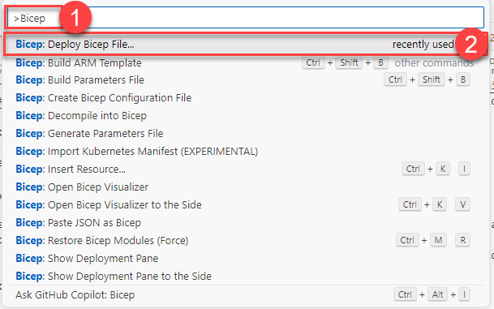
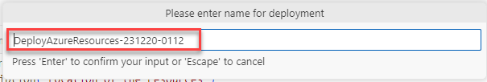
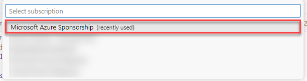
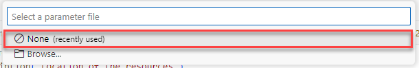
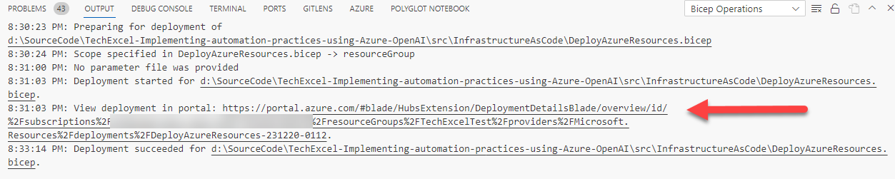

# Task 01 - Deploy supporting Azure services (20 minutes)

## Introduction

Contoso Suites has asked you to perform a proof of concept for using Azure OpenAI and Azure AI Services to improve the productivity of their support staff. In this second task, you will deploy a set of common Azure services, including Azure Cosmos DB, a storage account, and an Azure AI Search service, to an appropriate region.

{: .note }
> You will work with the GPT-4 model in this training. This will limit the number of regions you can use for deployment. Review the [region availability table](https://learn.microsoft.com/en-us/azure/ai-services/openai/concepts/models#model-summary-table-and-region-availability) and ensure that you choose a region that supports GPT-4.

## Description

In this task, you will prepare a resource group with three Azure services.

The key tasks are as follows:

1. Create a new resource group in your subscription. This subscription **must** have access to Azure OpenAI and you should deploy the resource group to a region that supports GPT-4.
2. Use the `DeployAzureResources.bicep` script in the `src\InfrastructureAsCode\` folder to deploy resources out.

## Success Criteria

- You have deployed all necessary services.

## Learning Resources

- [Step-by-Step Guide: Creating an Azure Resource Group on Azure Portal](https://techcommunity.microsoft.com/t5/startups-at-microsoft/step-by-step-guide-creating-an-azure-resource-group-on-azure/ba-p/3792368)
- [az group (Azure Resource Group)](https://learn.microsoft.com/en-us/cli/azure/group?view=azure-cli-latest)
- [Create Bicep files by using Visual Studio Code](https://learn.microsoft.com/en-us/azure/azure-resource-manager/bicep/visual-studio-code?tabs=CLI)

## Solution

Expand this section to view the solution

- To create a resource group using az cli, use the command `az group create`. An example of this is: `az group create -l eastus2 -n TechExcelTest`.
- If you have Visual Studio Code installed, you can use the [Bicep extension](https://marketplace.visualstudio.com/items?itemName=ms-azuretools.vscode-bicep) to run Bicep scripts by doing the following:
  - Open the **src\InfrastructureAsCode\DeployAzureResources.bicep** script.
  - Use Ctrl+Shift+P (or Cmd+Shift+P on Mac) to open the Visual Studio Code prompt. Then, type `Bicep` into the search menu and choose **Bicep: Deploy Bicep Script**.

      

  - Provide a name for the deployment or accept the automatically provided name.

      

  - Select the appropriate subscription. This subscription **must** be listed for Azure OpenAI access!

      

  - Select the resource group that you created.

      

  - There will not be a parameter file for this script, so it is safe to choose **None**.

      

  - At this point, the deployment script will kick off. You can select the link in the **Output** window to view your deployment.

      

