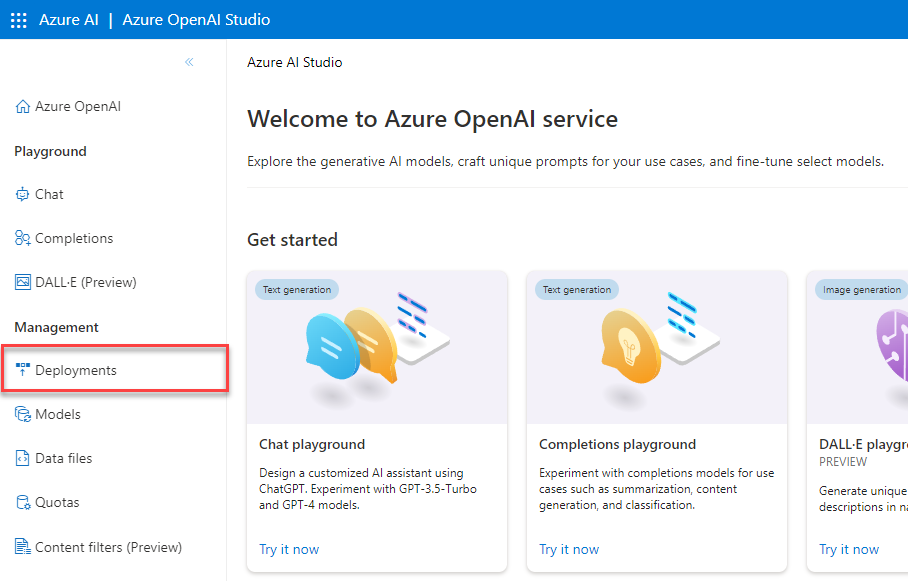
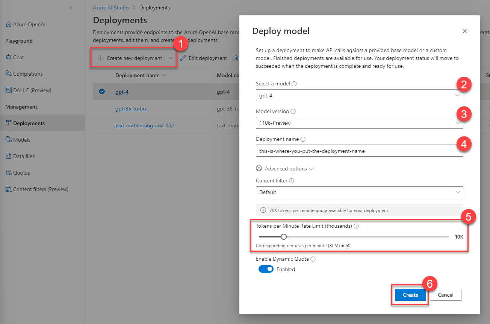

# Task 03 - Create and configure the Azure OpenAI Service (20 minutes)

## Introduction

The hero service for this training is the Azure OpenAI Service, which we will use throughout these exercises along with Azure AI Services. The staff at Contoso Suites has heard of OpenAI and are interested in seeing what it takes to get started with the service.

## Description

In this task, you will create an Azure OpenAI Service resource and two model deployments.

{: .note }
> You will work with the GPT-4 model in this training. This will limit the number of regions you can use for deployment. Review the [region availability table](https://learn.microsoft.com/azure/ai-services/openai/concepts/models#model-summary-table-and-region-availability) and ensure that you choose a region that supports GPT-4. Also, you will want to ensure that your region has [support for Azure AI Services](https://azure.microsoft.com/en-us/explore/global-infrastructure/products-by-region/?products=cognitive-services)

The key tasks are as follows:

1. Create an instance of the Azure OpenAI Service.
2. In the [OpenAI Studio](https://oai.azure.com), create two new deployments:
   1. A `gpt-4` deployment using the latest available model and a rate limit of 10K tokens per minute.
   2. A `text-embedding-ada-002` deployment using the latest available model and a rate limit of 120,000 tokens per minute.

## Success Criteria

- You have created an Azure OpenAI service instance in a valid region and have created two model deployments.

## Learning Resources

- [Azure OpenAI Service models - region availability](https://learn.microsoft.com/azure/ai-services/openai/concepts/models#model-summary-table-and-region-availability)
- [Create and deploy an Azure OpenAI Service resource](https://learn.microsoft.com/azure/ai-services/openai/how-to/create-resource?pivots=web-portal)
- [Working with Azure OpenAI models](https://learn.microsoft.com/azure/ai-services/openai/how-to/working-with-models)

## Solution

Expand this section to view the solution

- To create an instance of the Azure OpenAI Service, perform the following steps:
  - Navigate to [the Azure portal](https://portal.azure.com) and enter `Azure OpenAI` into the search box. Then, select the **Azure OpenAI** service link.

      

  - Select  **+ Create** to create a new instance of the service.
  - Choose the resource group you selected in Task 1 of this exercise. Make sure to create your resource in a region that supports GPT-4, such as East US 2. Provide a unique name and select **Standard S0** as the pricing tier. Then, choose **Next**.

      

  - Select **Next** for each of the following steps and **Create** on the final step to create the OpenAI resource.
- To create Azure OpenAI deployments, perform the following steps:
  - Navigate to the [OpenAI Studio](https://oai.azure.com).
  - Select the appropriate directory, subscription,and resource.
  - Navigate to the **Deployments** option in the **Management** menu.

      

  - Select **+ Create new deployment** to create a deployment. Select **gpt-4** for the model and the latest version (e.g., **1106-Preview**). Provide it a deployment name like `gpt-4`. In the **Advanced options** menu, set the Tokens per Minute Rate Limit (thousands) to **10**. Then select **Create** to create the deployment.

      

  - Perform the same steps to create a **text-embedding-ada-002** model deployment but ensure that it has a rate limit of 120,000 tokens.

