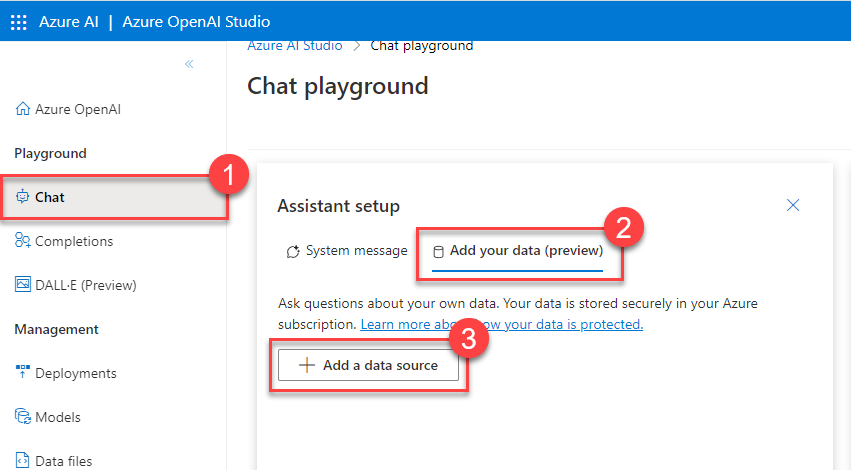
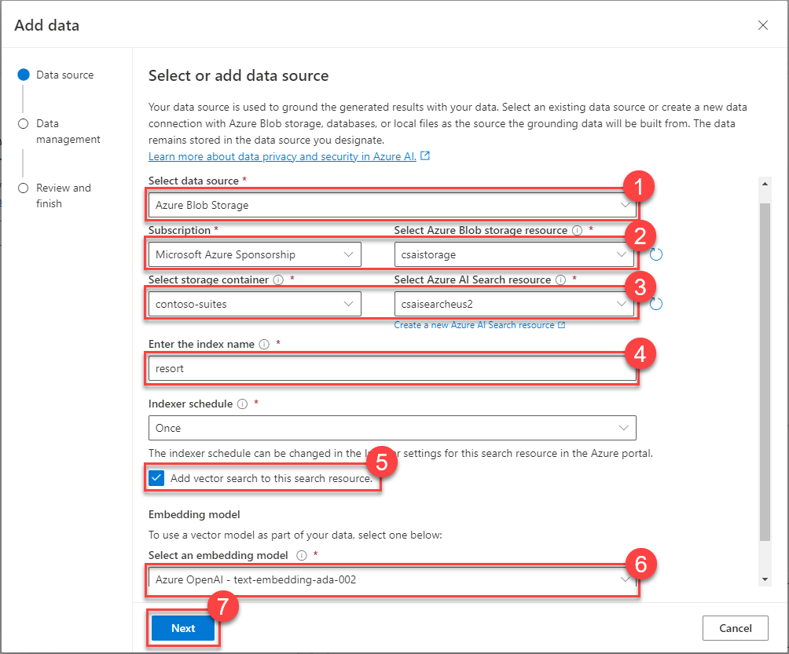
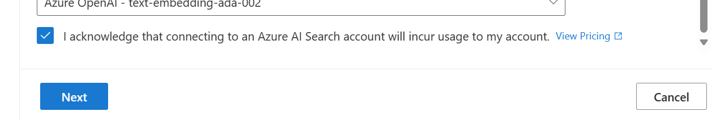
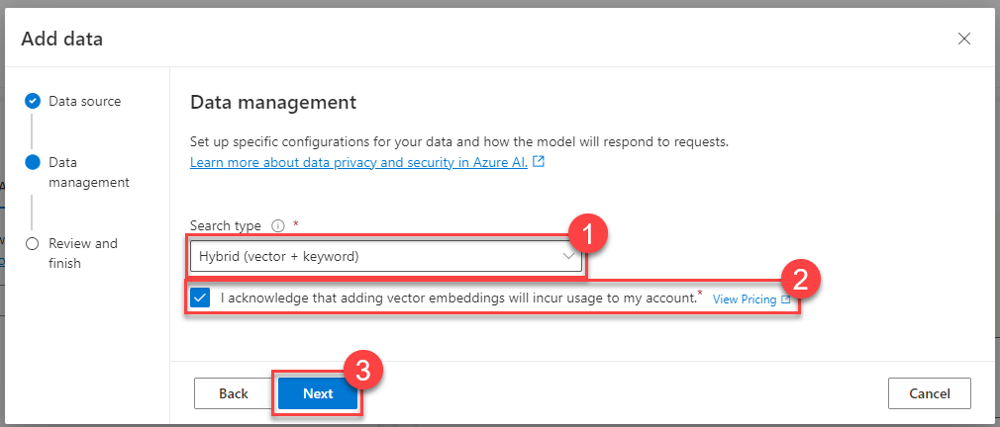

# Task 02 - Add data to the Chat playground (20 minutes)

## Introduction

Azure OpenAI supports adding data from a variety of Azure data sources, including Azure AI Search, Azure Blob Storage, Azure Cosmos DB for MongoDB vCore, data from a specific URL, or uploading local files. We can process data from these resources and make them available to an Azure OpenAI deployment, allowing an assistant to answer natural language user queries.

## Description

In the prior task, you made resort and hotel data available in Azure Blob Storage. In this task, you will show the Contoso Suites staff how to ask questions of a ChatGPT deployment based on the data you imported.

The key tasks are as follows:

1. Add a new data source for resort and hotel information in the Azure AI Studio Chat playground. Make sure that you have enabled vectorization using a text-embedding-ada-002 deployment.
2. Following is a sample customer request that a Contoso Suites customer service agent has received in the past. "I am looking for a sunny beachside resort on an island. There need to be diving opportunities nearby and I'd prefer it not to be too crowded an area. Which resorts would you recommend?" Enter this request into the chat session and note the response.
3. Following is a sample customer request that a Contoso Suites customer service agent has received in the past. "Our family is celebrating my mother's 90th birthday and we want to have that celebration in Aruba. Do you have a hotel that can accommodate 19 room rentals? And are there any reception rooms at that hotel?" Enter this request into the chat session and note the response.

## Success Criteria

- You have created vectorized indexes in Azure AI Search for resorts and hotels.
- You have demonstrated how to use the Chat playground to allow ChatGPT to interact with custom data.

## Learning Resources

- [Azure OpenAI on your data](https://learn.microsoft.com/azure/ai-services/openai/concepts/use-your-data)
- [Data, privacy, and security for Azure OpenAI Service](https://learn.microsoft.com/legal/cognitive-services/openai/data-privacy)

## Solution

Expand this section to view the solution

- All of this work can be done in the current Azure AI Studio (https://oai.azure.com).
- The steps to add a data source in the Chat playground are:
  - Navigate to the Chat tab in Azure AI Studio.
  - Select the "Add your data" tab from the Assistant setup page.
  - Select the **Add a data source** button.

    

  - In the modal dialog, choose "Azure Blob Storage" from the data source drop-down list.
    - CORS will need to be enabled for the storage account. You may do this from within the dialog, as long as you have appropriate permissions on the storage account.
  - Select the storage account you created and the `contoso-suites` storage container.
  - Choose the Azure AI Search resource you created.
  - The index name can be something simple, such as "resorts" and the Indexer schedule can be set to Once.
  - Select the "Add vector search to this search resource" option and choose your text-embedding-ada-002 deployment from the drop-down list.

    

    Be sure that you select the "I acknowledge that connecting to an Azure AI Search account will incur usage to my account." checkbox once it appears. It will appear after you have selected your storage account.

    .

  - From the Search type menu, choose "Hybrid (vector + keyword)" and select the option acknowledging that this will incur usage to your account.

    

- After ingestion and processing is complete, you can ask questions of the uploaded dataset.

