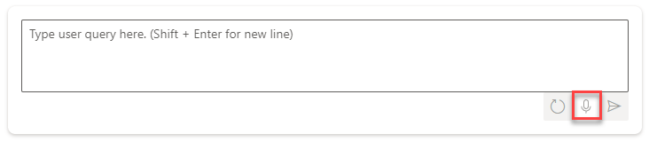
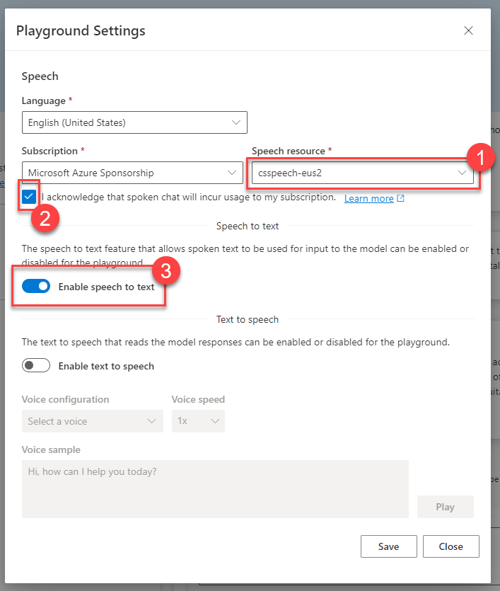

# Task 01 - Create a speech service (20 minutes)

## Introduction

Azure OpenAI has the capacity to parse natural language in textual format. We can also incorporate Azure AI Services and its Speech service to perform speech-to-text transcription, enabling us to use the output of the Speech service as an input for OpenAI prompts. Throughout the course of this exercise, you will create an Azure AI Services Speech service and test it out in the OpenAI Studio Chat playground. Then, you will incorporate the service in your existing Streamlit dashboard.

## Description

In this task, you will create an Azure AI Services Speech service and use it in the OpenAI Studio Chat playground. You will use it in conjunction with the resort and hotel information that you uploaded as part of Exercise 02.

The key tasks are as follows:

1. Create an Azure AI Services Speech service. Make sure it is in the same resource group and region as your OpenAI service.
2. In the [Azure OpenAI Studio](https://oai.azure.com), navigate to the Chat playground and ensure that your hotel and resort data is still available to the service.
3. Use the microphone icon below the user query input box to enable speech to text using your newly created Speech service.
4. Using your microphone, speak the following request: "I've visited Aruba and Bonaire before and would like to visit somewhere else. What other resort locations would be good options if I want to scuba dive?" Ensure that this is transcribed into the user query input box and submit the query.

## Success Criteria

- You have created an Azure AI Services Speech service.
- You are able to submit a spoken query using the Chat playground.

## Learning Resources

- [Speech service overview](https://learn.microsoft.com/en-us/azure/ai-services/speech-service/overview)
- [Quickstart: Hear and speak with chat models in the Azure AI Studio playground](https://learn.microsoft.com/en-us/azure/ai-studio/quickstarts/hear-speak-playground)

## Solution

Expand this section to view the solution

- The steps to create an Azure AI Services Speech service in the Azure Portal are as follows:
  - Navigate to [the Azure Portal](https://portal.azure.com)
  - In the search menu, enter "Azure AI services" and select the **Azure AI services** item from the **Services** menu.
  - Choose the **Speech service** entry from the **Azure AI services** menu.
  - Select **+ Create** to create a new speech service.
  - In the Create Speech Services menu, ensure that you select the same resource group and region that you chose for your OpenAI service. Choose the **Standard S0** pricing tier for this service.
  - Select the **Review + create** button to review your choices and then choose **Create** to build the service.

    

- Navigate to the [OpenAI Studio](https://oai.azure.com) and make sure you are in the chat playground by selecting **Chat** from the **Playground** menu.
- Navigate to **Add your data (preview)** and ensure that you still have the hotel and resorts index selected as your data source. If not, review the instructions in [Exercise 02, Task 02](../02_add_chat_with_data/0202.md) to repopulate this data source.
- In the chat playground, select the microphone icon below the user query input box.

    

- In the Playground Settings modal dialog, choose your speech resource from the drop-down list. Then, check the box acknowledging that spoken chat will incur usage to your subscription and enable speech to text. Select **Save** to complete the process.

    

- Select the microphone icon below the user query box. Using your microphone, speak the following request: "I've visited Aruba and Bonaire before and would like to visit somewhere else. What other resort locations would be good options if I want to scuba dive?"

    {: .note }
    > Your browser may prompt you for access to use your microphone.

